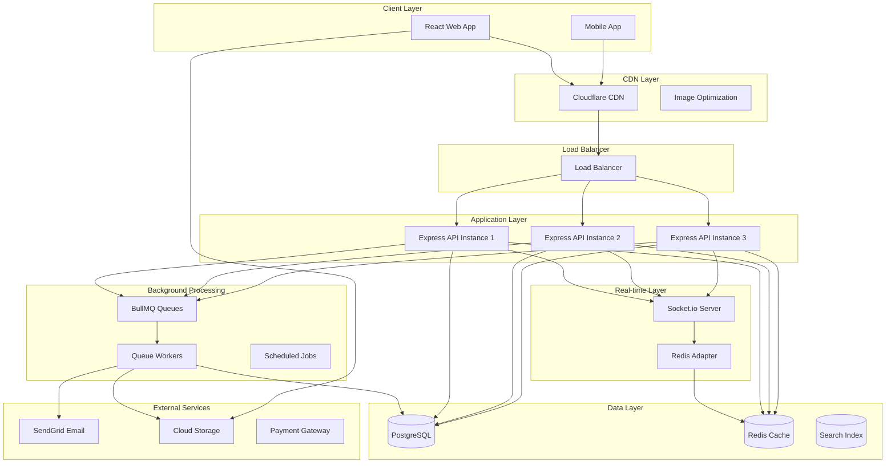
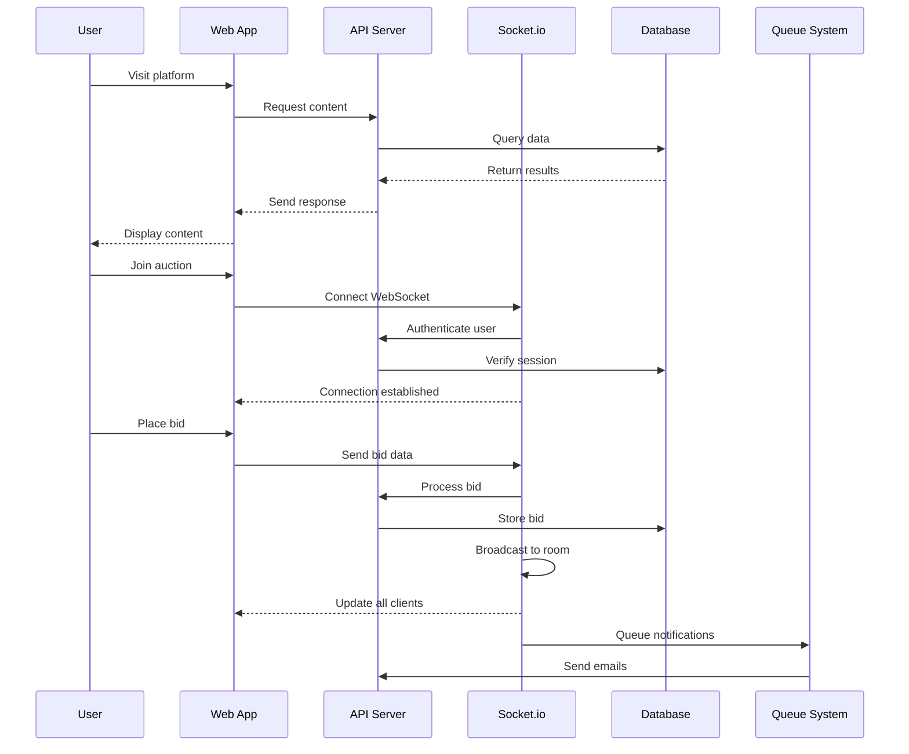
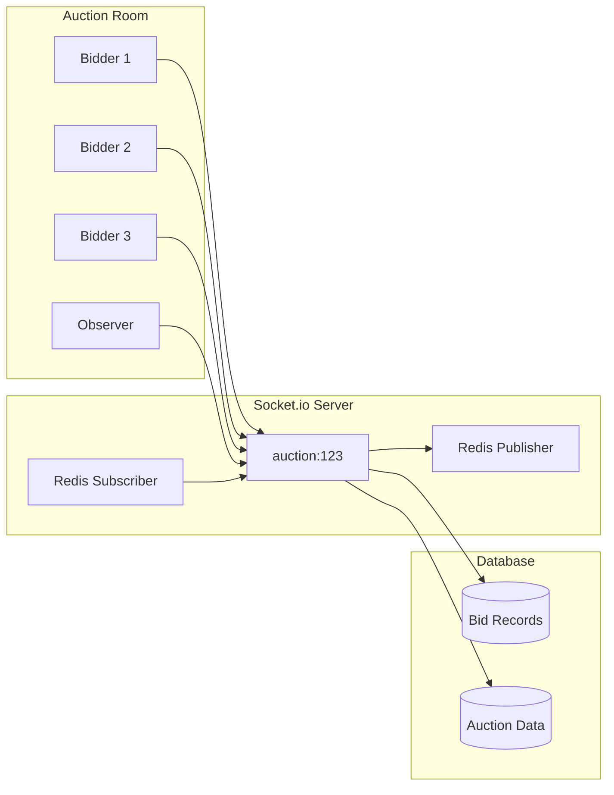

# Art Souk - Architecture Documentation

## System Overview

Art Souk is a production-grade, scalable art marketplace platform built for the Saudi Arabian and GCC markets. The platform facilitates connections between artists, galleries, collectors, and art enthusiasts through a comprehensive digital ecosystem.

## Architecture Diagram



## Technology Stack

### Frontend
- **Framework**: React 18 with TypeScript
- **Build Tool**: Vite for development and production builds
- **Routing**: Wouter for client-side routing
- **State Management**: TanStack Query for server state
- **Styling**: Tailwind CSS with Radix UI components
- **Internationalization**: react-i18next for Arabic/English support
- **Real-time**: Socket.io-client for live auction bidding

### Backend
- **Runtime**: Node.js with Express.js
- **Database**: PostgreSQL with Drizzle ORM
- **Authentication**: Replit Auth with OpenID Connect
- **Session Management**: Express sessions with PostgreSQL storage
- **Real-time**: Socket.io with Redis adapter for scaling
- **Background Jobs**: BullMQ with Redis
- **Email**: SendGrid with queue-based processing
- **Security**: Helmet, rate limiting, CSRF protection, file validation

### Infrastructure
- **Monorepo**: Turborepo for coordinated development
- **Caching**: Redis for sessions, real-time data, and job queues
- **CDN**: Cloudflare for static assets and images
- **Monitoring**: Built-in health checks and performance monitoring
- **Testing**: Vitest, Playwright, k6 for comprehensive coverage

## Data Flow

### User Journey Flow


### Real-time Auction System


## Security Architecture

### Defense in Depth
1. **Network Layer**: HTTPS/WSS encryption, rate limiting
2. **Application Layer**: CSRF protection, input validation, SQL injection prevention
3. **Authentication**: Multi-factor authentication, session management
4. **Authorization**: Role-based access control, resource-level permissions
5. **Data Layer**: Encrypted sensitive data, audit logging

### Security Headers
```typescript
// Helmet configuration
{
  contentSecurityPolicy: {
    directives: {
      defaultSrc: ["'self'"],
      styleSrc: ["'self'", "'unsafe-inline'", "https://fonts.googleapis.com"],
      fontSrc: ["'self'", "https://fonts.gstatic.com"],
      imgSrc: ["'self'", "data:", "https:"],
      scriptSrc: ["'self'"],
      connectSrc: ["'self'", "ws:", "wss:"],
      objectSrc: ["'none'"],
      mediaSrc: ["'self'"],
      frameSrc: ["'none'"],
    },
  },
  crossOriginEmbedderPolicy: false
}
```

## Performance Optimization

### Caching Strategy
- **Static Assets**: CDN caching with long TTL
- **API Responses**: Redis caching for frequently accessed data
- **Database**: Query optimization with proper indexing
- **Images**: WebP conversion and responsive sizing

### Load Balancing
- **Horizontal Scaling**: Multiple API instances behind load balancer
- **Socket.io Scaling**: Redis adapter for cross-instance communication
- **Database**: Read replicas for improved read performance

## Monitoring and Observability

### Metrics
- **Performance**: Response times, throughput, error rates
- **Business**: User engagement, auction participation, conversion rates
- **Infrastructure**: Server health, database performance, queue processing

### Alerting
- **Critical**: Service outages, database failures
- **Warning**: High response times, elevated error rates
- **Info**: Deployment notifications, scaling events

## Deployment Strategy

### Environment Progression
1. **Development**: Local development with hot reloading
2. **Staging**: Production-like environment for testing
3. **Production**: Multi-instance deployment with blue-green strategy

### CI/CD Pipeline
```yaml
# GitHub Actions workflow
stages:
  - code-quality: # Linting, type checking
  - unit-tests: # Component and utility testing
  - integration-tests: # API endpoint testing
  - e2e-tests: # User flow testing
  - load-tests: # Performance testing
  - security-scan: # Vulnerability assessment
  - build: # Production build creation
  - deploy: # Automated deployment
```

## Scalability Considerations

### Horizontal Scaling
- **Stateless API servers**: Easy to add/remove instances
- **Socket.io clustering**: Redis adapter enables multi-instance real-time
- **Queue workers**: Scalable background job processing

### Database Optimization
- **Indexing**: Strategic indexes for query performance
- **Partitioning**: Time-based partitioning for large tables
- **Caching**: Intelligent caching to reduce database load

### CDN Strategy
- **Static Assets**: Global distribution for fast loading
- **Image Optimization**: Automatic format conversion and resizing
- **API Caching**: Edge caching for frequently requested data

## Future Architecture Evolution

### Phase 2 Enhancements
- **Microservices**: Split monolith into focused services
- **Event Sourcing**: Implement for audit trails and replay capability
- **GraphQL**: Add GraphQL layer for flexible data fetching
- **Machine Learning**: Recommendation engine for personalized content

### Phase 3 Scaling
- **Multi-region**: Deploy across multiple geographic regions
- **Advanced Caching**: Implement sophisticated caching strategies
- **Analytics Platform**: Real-time analytics and business intelligence
- **Mobile Apps**: Native iOS and Android applications